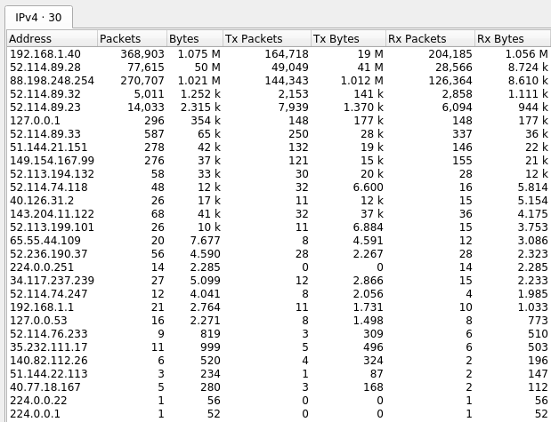

# sFlow-Monitoring-Tool

## Introduction

This tool utilizes the sFlow packet sampling technology to determine the Top Talkers in the network.

To decode sFlow data the tool utilizes a Python library called `python-sflow` (https://github.com/auspex-labs/sflow-collector/blob/develop/sflow.py).

The errors are calculated using the formulas provided by sFlow at https://sflow.org/packetSamplingBasics/.

---

## Requirements

* [sFlow](https://sflow.net/downloads.php)

---

## Run

In order to start analizing packets it is necessary to configure sFlow by adding a collector in the config file, under the section "collectors".

At this point the only thing left to do to start the tool is executing the following command:

    python3 main.py

The program accepts the following arguments, and if they are not specified the default value is used:
* -p    sFlow collector port (default=6343)
* -a    sFlow collector ip (default=127.0.0.1)
* -m    Max number of talkers to display (default=0, unlimited)
* -h    Help function

It is also possible to interact with the tool by pressing the following keys while it's running:

* r Reload the informations
* s Switch sorting method
* q Exit the tool

---

## Test

### Testing environment

* sFlow installed on local machine reporting on loopback
* MSTeams conference open
* Downloading 1GB file from https://speed.hetzner.de/ (IP 88.198.248.254)

### Testing procedure

* Started our tool and [Wireshark](https://www.wireshark.org/) at the same time
* Downloaded the 1GB test file
* Compared the result from our tool with the Endpoints analyzer in Wireshark

### Results

As we can see the results from Wireshark roughly matches ours.
The discrepancies in the data and the fact that our tool recorded less IPs than wireshark are a result of the core functioning model of sFlow.

